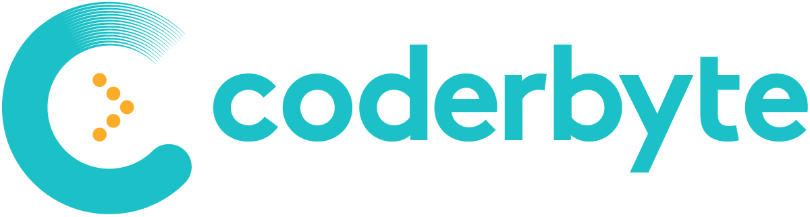

# Problem Solving

This repository is not Language-based. You can find practices dedicated to each language on my profile. But here, it's all about problem-solving. The ways to solve each problem. I'll try my best to come back and improve my answers.

Some of my resources are:

* [CoderByte.com](#coderbyte)
* [HackerRank.com](#hackerrank)
* [LeetCode.com](#leetcode)

If you want to focus on learning a specific **programming language**, I recommend [Exercism](https://exercism.org/tracks).

## **Daily Update**

I'm a beginner and this is my plan to improve my problem-solving skills. So each day, I try to solve a problem in an hour or less. If it takes more than that, I just commit all I've done until that point. You can follow along or you can find the codes based on their provider and level.

> `🌀` - Easy
>
> `🎯` - Medium
>
> `🔥` - Hard

I don't check recommended solutions from the website until I figure out the solution by myself. At first, you should solve the problem in any way that you can think of. Then you have to think about the ways to optimize your solution. If you can't go further, then check the recommended Solutions or other people's solutions for the problem. You can learn better in this way.

### LeetCode

* `0001`
  * `🌀` - [Two Sum](https://github.com/MahdiDavoodi/ProblemSolving/tree/main/LeetCode/TwoSum) - `Java`
* `0002`
  * `🌀` - [Add Two Numbers](https://github.com/MahdiDavoodi/ProblemSolving/tree/main/LeetCode/AddTwoNumbers) - `Java`
* `0003`
  * `🌀` - [Longest Substring Without Repeating Characters](https://github.com/MahdiDavoodi/ProblemSolving/tree/main/LeetCode/LongestSubstringWithoutRepeatingCharacters) - `Kotlin`
* `0004`
  * `🌀` - [Valid Parentheses](https://github.com/MahdiDavoodi/ProblemSolving/tree/main/LeetCode/ValidParentheses) - `Kotlin`
* `0005`
  * `🌀` - [Palindrome Number](https://github.com/MahdiDavoodi/ProblemSolving/tree/main/LeetCode/PalindromeNumber) - `Kotlin`

## CoderByte

* `001`
  * `🌀` - [First Reverse](https://github.com/MahdiDavoodi/ProblemSolving/tree/main/CoderByte/FirstReverse) - `Kotlin`

> Since December 2021.
